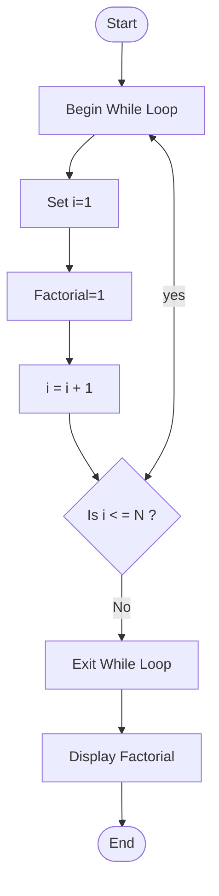

```mermaid
flowchart TB
    A([Start])--> B[Input Length]
    B--> C[Input Width]
    C--> D{ Length × Width}
    D--> E[Display Area]
    E--> F([End])
```

```mermaid
flowchart TB
A([Start])--> B[Input Average marks]
         B--> C{Is Average marks ≥ 50 ?}
         C--> D[Display Pass]
            C --> E[Display Fail]
            C --> F([End])            
```

# Workshop: Algorithm and Flowchart

For each question in this workshop, you must complete **two** things:

1.  **Write the pseudocode**
2.  **Draw the flowchart** using either
    - **Option 1:** Draw.io (recommended) → export image → upload to
      your repository → link it in this file
    - **Option 2 (optional):** Write a Mermaid flowchart directly in
      Markdown
    - **Option 3 (optional):** Any other valid method

👉 **IMPORTANT:** At the **bottom of each question**, add the
following sections:

### ✔ Pseudocode

### ✔ Flowchart

---

## 1. Check Even or Odd Number

Design an algorithm and flowchart that take a number as input and
determine whether it is even or odd.

### ✔ Pseudocode

```text
START
    INPUT number
    IF number % 2 == 0 THEN
        PRINT Even
    ELSE
        PRINT Odd
    ENDIF
END
```

### ✔ Flowchart


---

## 2. Calculate Total and Average Marks

Write the algorithm and draw the flowchart for a program that inputs
marks for 3 subjects, calculates the total and average, and displays
Toal and result of avraige.
(3 subject; MarkA, MarkB and MarkC)


### ✔ Pseudocode
```text
Start
    Input Number MarkA, MarkB, MarkC
         Cont=Total
         Avg= Total/3 subject
         Display; Total
         Display; Avg Result
End
```
### ✔ Flowchart


---

## 3. Display Multiplication Table

Create an algorithm and flowchart that input a number and display its
multiplication table from 1 to 10 using a loop.

### ✔ Pseudocode
```text
1.Start Row = 1
2. OuterLine: If Row < = 10 ?
    .No: End.
    .Yes: set col = 1.
3.Inner line: If col < = 10?
    Yes: Print out Row ' col. Add col +1.
    Go to step 3.
    No: Print New Row. Add Row +1.
    Go to step 2.
 End
 ```  

### ✔ Flowchart 


---

## 4. Positive, Negative, or Zero Check

Write the algorithm and flowchart to input a number and display whether
it is positive, negative, or zero.

### ✔ Pseudocode
```text
Srart 
    Set X = 0
    Print:"Input Numper"
    If >= 0
    Yes: = 0 Display Zero
    Yes: > 0 Display Plus
    No: Display Minus
End
```
### ✔ Flowchart
 ```mermaid
    flowchart TB
A([Start])--> B[X = 0]
B-->C{Is X > = 0?}
C-->|Yes = 0| D[Zero]
C-->|Yes > 0| E[Plus]
C-->|No| F[Minus]
D-->G([End])
E-->G([End])
F-->G([End])
```
---

## 5. Simple Interest Calculator
```
Create an algorithm and flowchart for a program that calculates simple interest using the formula **SI = (P × R × T) / 100**
- **P = Principal** → original amount of money
- **R = Rate of Interest** → percentage per year
- **T = Time** → number of years
```
### ✔ Pseudocode
```text
Start
    Input P
    Input R
    Input T
    SI= (P'R'T)/100
    Print SI
End
```
### ✔ Flowchart
```mermaid
flowchart TB
    A([Start])
    A--> B[Enter P, the principal amount]
    A--> C[Enter R, the rate of interest]
    A--> D[Enter T, the time period]
    D--> E{SI=(P'R'T)/100}
    E--> F[Display SI]
    G([End])
```
---

## 6. Average Temperature Calculation

Write the algorithm and draw the flowchart for a program that takes the
temperature of 7 days, finds the average temperature, and displays it.
```
### ✔ Pseudocode
```text
Start
    Sum = 0
    Day = 1
    WHILE day <= 7 Do
        Input Temp
        Sum = sum + Temp
        Day = Day + 1
    EndWhile
    Averaige = sum / 7
    Print averaige
End
```
### ✔ Flowchart

---

## 7. Calculate Area of a Rectangle
```
Create an algorithm and flowchart to input length and width, calculate
the area (**Area = Length × Width**), and display the result.
```
### ✔ Pseudocode
```
Start
    Print Length[Input Number]
    Print Width[Input Number]
    Count {Area= Length × Width}
    Display Area
End
```
### ✔ Flowchart

---

## 8. Determine Pass or Fail

Write the algorithm and draw the flowchart for a program that takes a
student's average marks and displays **"Pass"** if average ≥ 50,
otherwise **"Fail"**.

### ✔ Pseudocode
```text
Start
    Input Average
    If Average ≥ 50
        Print Pass
    Else
        Print Faile
    End If
End
```
### ✔ Flowchart

---
```
## 9. Calculate Factorial of a Number

Write the algorithm and draw the flowchart that input a number and
calculate its factorial using a loop.
```
### ✔ Pseudocode
```text
Start  
    Input N
    Fact = 1
    i = 1
    While i <= N Do:
        Fact = Fact * i + 1
        i = i + 1
    End While
    Print Fact
End
```
### ✔ Flowchart

---

## 10. Calculate Discount on Purchase

Write the algorithm and draw the flowchart for a program that inputs the
purchase amount and gives a **10% discount** if the amount is greater
than 1000.
### ✔ Pseudocode
```text
Start
    Input Amount
    If Amount= 1000 Then
    Discount = Amount * 0.10
Else
    Discount = 0
    End If
    Final Amount= Amount - Discount
    Print Discount
    Print FinalAmount
End
```
### ✔ Flowchart

---
